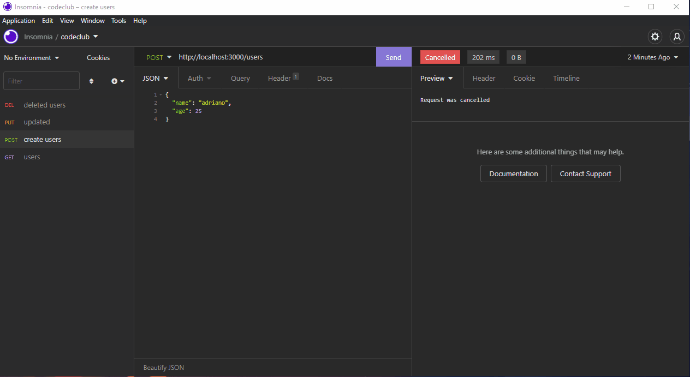

# projectNode

<h2>Criando rotas com Node!</h2>
 

> Get, Post, Put, Delete!

 

Foi usado uma API chamada "uuid", para a criação de ID's. 

### Para rodar na sua maquina:

- Node
- Express
- Uuid
- insomnia

## 🤝 Colaborador

<table>
  <tr>
    <td align="center">
      <a href="#">
         
        
          <b>Adriano Santos</b>
        
      </a>
    </td>
